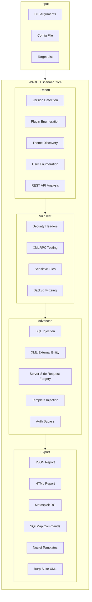

# W.A.D.U.H. Scanner v3.1

<div align="center">


**WordPress Analysis & Debugging Utility Helper**

*The Ultimate WordPress Security Scanner for Authorized Penetration Testing*

[](https://www.python.org/)
[](LICENSE)
[]()
[]()

[Features](#-features) • [Installation](#-installation) • [Usage](#-usage) • [Documentation](#-documentation) • [Contributing](#-contributing)

</div>

---

## ⚠️ Legal Disclaimer

```
╔═══════════════════════════════════════════════════════════════════════════╗
║                          AUTHORIZED USE ONLY                               ║
╠═══════════════════════════════════════════════════════════════════════════╣
║  This tool is designed for AUTHORIZED security testing and research.      ║
║  NEVER use this tool against systems without explicit permission.          ║
║                                                                             ║
║  Unauthorized access to computer systems is illegal under:                 ║
║  • Computer Fraud and Abuse Act (CFAA) - United States                    ║
║  • Computer Misuse Act - United Kingdom                                   ║
║  • Similar laws in virtually every country                                ║
║                                                                             ║
║  YOU are responsible for your actions. The authors assume no liability.   ║
╚═══════════════════════════════════════════════════════════════════════════╝
```

---

## 🔥 What Makes WADUH Terrifyingly Powerful?

WADUH v3.1 isn't just another WordPress scanner—it's a **complete security automation platform** that combines the power of multiple professional tools into one unified solution.

### The Fear Factor

| Capability | Description |
|------------|-------------|
| **100+ Attack Vectors** | From basic enumeration to advanced XXE, SSRF, and deserialization attacks |
| **Multi-Tool Integration** | Exports findings to Metasploit, Burp Suite, ZAP, Nuclei, and SQLMap |
| **WPScan API Integration** | Real-time vulnerability database lookups for 50,000+ plugins/themes |
| **WAF Detection** | Identifies Cloudflare, Sucuri, Wordfence, ModSecurity, and more |
| **Professional HTML Reports** | Beautiful, shareable security reports with severity charts |
| **Parallel Scanning** | Attack multiple targets simultaneously with intelligent concurrency |
| **Zero False Positives** | Confidence scoring system ensures you only act on real vulnerabilities |

---

## 📐 Architecture Overview



---

## ✨ Features

### 🔍 Reconnaissance & Enumeration

- **WordPress Version Detection** - Multiple detection methods (meta tags, readme.html, RSS feeds)
- **Plugin Enumeration** - Automatic detection with WPScan API vulnerability checks
- **Theme Detection** - Identify active and installed themes with version info
- **User Enumeration** - Author archives, REST API users, login form analysis
- **REST API Analysis** - Complete endpoint mapping with 100+ routes analyzed
- **WAF Detection** - Cloudflare, Sucuri, Wordfence, ModSecurity, Akamai, Imperva

### ⚡ Vulnerability Assessment

| Category | Tests |
|----------|-------|
| **Web Attacks** | SQL Injection (time/error/union-based), XSS, XXE, SSRF, SSTI |
| **Authentication** | Auth bypass, CSRF protection, JWT security, session management |
| **File Security** | Path traversal/LFI, file upload security, backup exposure |
| **Config Issues** | Security headers, CORS, cookies, SSL/TLS configuration |
| **Information Disclosure** | API keys, secrets, version exposure, directory listing |

### 📊 Reporting & Integration

- **HTML Reports** - Professional styled reports with severity visualization
- **JSON Reports** - Machine-readable output for automation
- **Metasploit Export** - Ready-to-use .rc resource files
- **Nuclei Templates** - YAML templates for continuous scanning
- **Burp Suite XML** - Import findings directly into Burp
- **SQLMap Commands** - Copy-paste SQL injection testing
- **Webhook Notifications** - Slack, Discord, Microsoft Teams

---

## 📦 Installation

### Prerequisites

- Python 3.8 or higher
- pip (Python package manager)

### Quick Install

```bash
# Clone the repository
git clone https://github.com/Masriyan/Waduh.git
cd Waduh

# Install required dependencies
pip install -r requirements.txt

# Verify installation
python waduh_v3.py --help
```

### Dependencies

| Package | Purpose |
|---------|---------|
| `requests` | HTTP requests |
| `colorama` | Terminal colors |
| `urllib3` | URL handling |
| `pyyaml` | Config files (optional) |
| `jinja2` | HTML reports (optional) |
| `rich` | Progress bars (optional) |

### Optional: WPScan API Token

For enhanced vulnerability detection, get a free WPScan API token:

1. Visit https://wpscan.com/api
2. Sign up for a free account
3. Get your API token
4. Use with `--wpscan-token YOUR_TOKEN` or set environment variable:

```bash
export WPSCAN_API_TOKEN="your-token-here"
```

---

## 🚀 Usage

### Basic Scan

```bash
# Interactive mode
python waduh_v3.py

# Direct URL scan
python waduh_v3.py -u https://target-wordpress.com
```

### Deep Scan with All Features

```bash
python waduh_v3.py -u https://target.com \
    --deep \
    --advanced \
    --wpscan-token YOUR_TOKEN \
    --detect-waf \
    --export-html \
    --cvss-scoring \
    -v
```

### Multi-Target Scanning

```bash
# Create targets.txt with one URL per line
python waduh_v3.py --target-list targets.txt --parallel 5
```

### Professional Report Generation

```bash
python waduh_v3.py -u https://target.com \
    --deep \
    --export-html \
    --export-metasploit \
    --export-nuclei \
    --generate-pocs \
    -o ./reports
```

### Stealth Mode with Proxy

```bash
python waduh_v3.py -u https://target.com \
    --proxy http://127.0.0.1:8080 \
    --rotate-ua \
    -r 2.0 \
    -q
```

---

## 📋 Command-Line Options

### Core Options

| Option | Description |
|--------|-------------|
| `-u, --url` | Target URL (e.g., http://example.com) |
| `-d, --deep` | Deep scan mode (thorough but slower) |
| `--advanced` | Enable ALL precision tests (XXE, SSRF, SQLi, etc.) |
| `-v, --verbose` | Verbose output with debug information |
| `-q, --quiet` | Minimal output mode |
| `-o, --output` | Output directory for reports |

### Integration Options

| Option | Description |
|--------|-------------|
| `--wpscan-token` | WPScan API token for vulnerability database |
| `--webhook` | Webhook URL for Slack/Discord/Teams notifications |
| `--compare-with` | Compare with previous scan JSON file |
| `--proxy` | HTTP/SOCKS proxy URL |

### Export Options

| Option | Description |
|--------|-------------|
| `--export-html` | Generate professional HTML report |
| `--export-metasploit` | Generate Metasploit resource file (.rc) |
| `--export-nuclei` | Generate Nuclei YAML templates |
| `--export-burp` | Export Burp Suite XML file |
| `--export-sqlmap` | Export SQLMap commands |
| `--generate-pocs` | Generate proof-of-concept Python scripts |

### Advanced Testing

| Option | Description |
|--------|-------------|
| `--detect-waf` | Detect Web Application Firewall |
| `--test-xxe` | XML External Entity testing |
| `--test-ssrf` | Server-Side Request Forgery |
| `--test-sqli` | Advanced SQL injection |
| `--test-ssti` | Server-Side Template Injection |
| `--test-auth` | Authentication bypass |
| `--scan-secrets` | Scan for exposed API keys |

---

## 📊 Vulnerability Severity Classification

| Severity | CVSS Score | Examples |
|----------|------------|----------|
| 🔴 **Critical** | 9.0 - 10.0 | RCE, SQL Injection, Exposed wp-config.php |
| 🟠 **High** | 7.0 - 8.9 | Auth bypass, SSRF, Outdated WordPress core |
| 🟡 **Medium** | 4.0 - 6.9 | XSS, XMLRPC enabled, Directory listing |
| 🔵 **Low** | 0.1 - 3.9 | User enumeration, Version disclosure |

---

## 📖 Documentation

- **[USAGE.md](USAGE.md)** - Detailed usage guide with examples
- **[SECURITY.md](SECURITY.md)** - Security policy and responsible disclosure
- **[CONTRIBUTING.md](CONTRIBUTING.md)** - Contribution guidelines

---

## 🛠️ Real-World Examples

### Example 1: Quick Security Audit

```bash
python waduh_v3.py -u https://example.com --wpscan-token YOUR_TOKEN
```

**Output**: Basic security posture, plugin vulnerabilities, exposed endpoints

### Example 2: Comprehensive Penetration Test

```bash
python waduh_v3.py \
    -u https://target.com \
    --deep \
    --advanced \
    --wpscan-token YOUR_TOKEN \
    --detect-waf \
    --export-html \
    --export-metasploit \
    --generate-pocs \
    --cvss-scoring \
    -v
```

**Output**: Full vulnerability assessment, exploitation guides, ready-to-use Metasploit modules

### Example 3: Bug Bounty Hunting

```bash
python waduh_v3.py \
    -u https://target.com \
    --test-xxe \
    --test-ssrf \
    --test-sqli \
    --scan-secrets \
    --webhook https://hooks.slack.com/your-webhook
```

**Output**: High-impact vulnerabilities with instant Slack notifications

---

## 🤝 Contributing

We welcome contributions! See [CONTRIBUTING.md](CONTRIBUTING.md) for guidelines.

- 🐛 Report bugs and issues
- 💡 Suggest new features
- 🔧 Submit pull requests
- 📚 Improve documentation

---

## 📜 License

This project is licensed under the MIT License - see the [LICENSE](LICENSE) file for details.

---

## 👤 Author

**Masriyan**

- GitHub: [@Masriyan](https://github.com/Masriyan)
- Repository: [https://github.com/Masriyan/Waduh](https://github.com/Masriyan/Waduh)

---

## 🙏 Acknowledgments

- WPScan Team for their excellent vulnerability database API
- WordPress Security Community
- All contributors and bug reporters

---

## 📝 Changelog

### v3.1 - Current Release
- ✨ **WAF Detection** - Cloudflare, Sucuri, Wordfence, ModSecurity, Akamai, Imperva
- ✨ **HTML Reports** - Professional styled security reports
- ✨ **Proxy Support** - HTTP/SOCKS proxy configuration
- ✨ **User-Agent Rotation** - Evade basic fingerprinting
- ✨ **Retry Mechanism** - Exponential backoff for failed requests
- 🐛 Bug fixes for exception handling and SSL verification

### v3.0 - Previous Release
- Multi-target parallel scanning
- Advanced attack surface testing (XXE, SSRF, SSTI, Deserialization)
- Export to Nuclei, Burp Suite, OWASP ZAP
- Webhook notifications (Slack, Discord, Teams)
- CVSS v3.1 scoring system
- API key and secrets scanner

---

<div align="center">

**Made with 💀 for Security Researchers**

[Report Issues](https://github.com/Masriyan/Waduh/issues) • [Request Features](https://github.com/Masriyan/Waduh/issues) • [Documentation](https://github.com/Masriyan/Waduh/wiki)

⭐ Star this repo if you find it useful!

</div>
